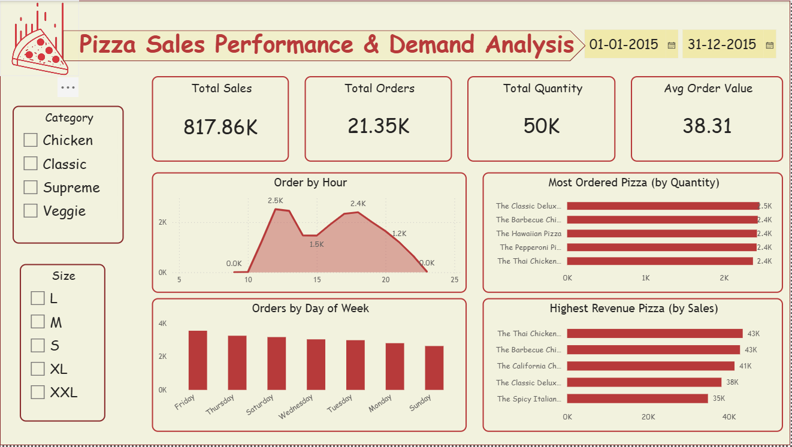
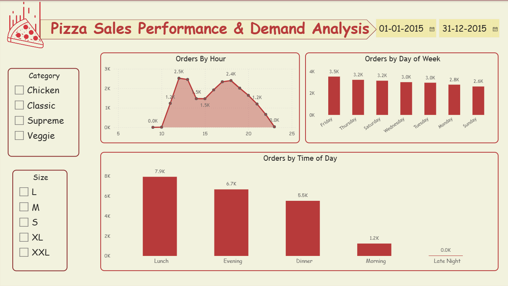
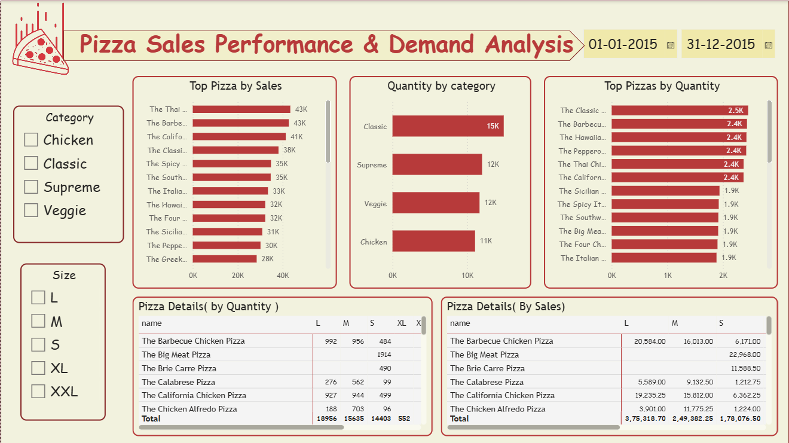

#  Pizza Sales Analysis Dashboard (Power BI)

##  Project Overview

This project analyzes pizza sales data to uncover key business insights such as peak ordering times, top-selling products, and revenue drivers. The dashboard is built using Power BI and simulates a real-world business scenario where stakeholders require actionable insights for decision-making.

---

##  Business Problem

The objective of this project is to answer key business questions:

* Identify peak and low order times
* Determine which day of the week generates the most orders
* Calculate total revenue
* Identify the most ordered pizza
* Determine which pizza generates the highest revenue
* Analyze ordering patterns by time of day
* Identify the best-performing pizza category

---

##  Key Insights

* Peak orders occur during **evening hours (6 PM – 9 PM)**
* **Friday and Saturday** have the highest number of orders
* The **Classic category** contributes the highest revenue
* Large-size pizzas generate more revenue compared to other sizes
* A few top pizzas contribute significantly to total sales (Pareto effect)

---

##  Dashboard Preview

### 🔹 Overall Dashboard



### 🔹 Sales Analysis



### 🔹 Category Analysis



---

##  Tools & Technologies

* Power BI
* DAX (Data Analysis Expressions)
* Data Modeling (Star Schema)
* CSV / Excel

---

##  Skills Demonstrated

* Data Cleaning & Transformation
* Data Modeling (Fact & Dimension Tables)
* DAX Measures & KPIs
* Time-Based Analysis
* Business Insight Generation
* Dashboard Design & Visualization

---

##  Dataset

The dataset includes:

* Orders data
* Order details
* Pizza information
* Pizza categories

(Source: Public dataset / Maven Analytics)

---

##  Data Model

The project follows a **Star Schema**:

* Fact Tables: Orders, Order Details
* Dimension Tables: Pizzas, Pizza Types

This improves performance and ensures scalable analytics.

---

##  Key DAX Measures

```DAX
Total Revenue = SUM(order_details[total_price])

Total Orders = DISTINCTCOUNT(orders[order_id])

Average Order Value = DIVIDE([Total Revenue], [Total Orders])

Total Quantity = SUM(order_details[quantity])
```

---

##  How to Use

1. Download the `.pbix` file
2. Open in Power BI Desktop
3. Refresh data if required
4. Interact with filters and visuals

---

##  Use Case

This project simulates a real-world scenario where business stakeholders need insights to:

* Optimize sales strategy
* Improve product offerings
* Identify high-performing categories
* Understand customer behavior patterns

---

##  Author

**Shitiz Sharma**
Aspiring Data Analyst | Power BI | SQL | Python

---
